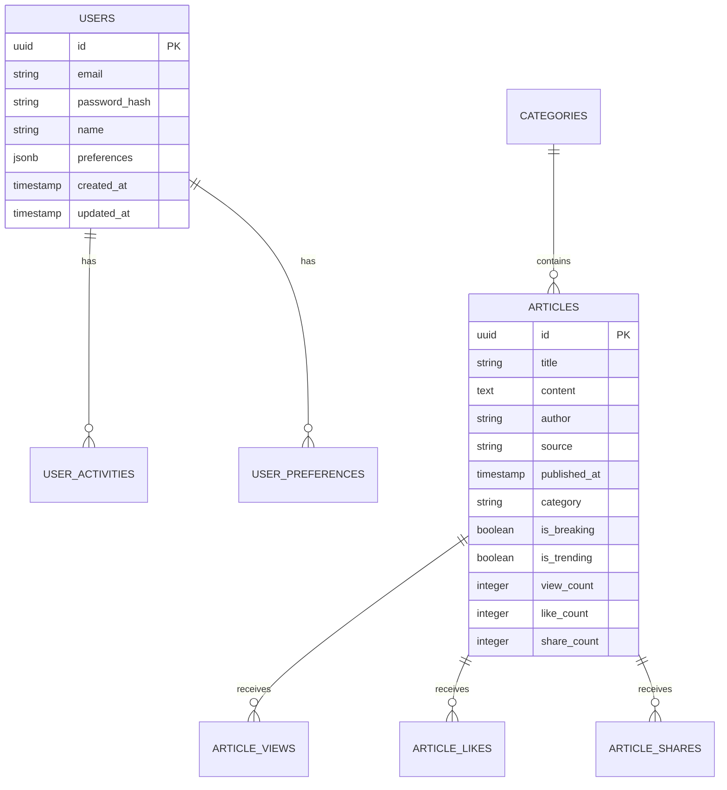

# NewsLocal Technical Architecture 🏗️

## System Overview

NewsLocal is built using a modern, scalable architecture that separates concerns and enables independent scaling of different components. The system follows Clean Architecture principles with clear separation between presentation, business logic, and data layers.

## 🎯 Architecture Principles

### **Core Principles**
- **Clean Architecture**: Dependency inversion, separation of concerns
- **SOLID Principles**: Single responsibility, open/closed, Liskov substitution
- **Microservices Ready**: Modular, independently deployable services
- **Event-Driven**: Asynchronous communication, real-time updates
- **API-First**: RESTful APIs with OpenAPI documentation
- **Security by Design**: Authentication, authorization, data protection

### **Design Patterns**
- **MVVM**: Model-View-ViewModel for iOS
- **Repository Pattern**: Data access abstraction
- **Dependency Injection**: Loose coupling, testability
- **Observer Pattern**: Reactive programming with Combine
- **Factory Pattern**: Object creation abstraction
- **Strategy Pattern**: Algorithm selection at runtime

## 📱 iOS App Architecture

### **Layered Architecture**

```
┌─────────────────────────────────────┐
│           Presentation Layer        │
│  ┌─────────────┐  ┌─────────────┐   │
│  │    Views    │  │ ViewModels  │   │
│  │ (SwiftUI)   │  │ (Combine)   │   │
│  └─────────────┘  └─────────────┘   │
└─────────────────────────────────────┘
┌─────────────────────────────────────┐
│           Business Layer            │
│  ┌─────────────┐  ┌─────────────┐   │
│  │  Use Cases  │  │  Services   │   │
│  │  (Logic)    │  │ (Protocols) │   │
│  └─────────────┘  └─────────────┘   │
└─────────────────────────────────────┘
┌─────────────────────────────────────┐
│            Data Layer               │
│  ┌─────────────┐  ┌─────────────┐   │
│  │Repositories │  │ Data Sources│   │
│  │ (Abstract)  │  │ (Network)   │   │
│  └─────────────┘  └─────────────┘   │
└─────────────────────────────────────┘
```

### **Core Components**

#### **Models**
```swift
// Core/Models/NewsModels.swift
struct NewsArticle: Identifiable, Codable {
    let id: String
    let title: String
    let content: String
    let summary: String
    let author: String
    let source: String
    let publishedAt: Date
    let category: NewsCategory
    let imageUrl: URL?
    let articleUrl: URL
    let isBreaking: Bool
    let isTrending: Bool
    let viewCount: Int
    let likeCount: Int
    let shareCount: Int
    
    // Computed properties
    var readingTime: Int { content.estimatedReadingTime }
    var timeAgo: String { publishedAt.timeAgo }
}
```

#### **Services**
```swift
// Core/Services/NewsServiceProtocol.swift
protocol NewsServiceProtocol {
    func fetchTopHeadlines(category: NewsCategory?) async throws -> [NewsArticle]
    func fetchBreakingNews() async throws -> [NewsArticle]
    func fetchTrendingNews() async throws -> [NewsArticle]
    func searchArticles(query: String, filters: SearchFilters?) async throws -> [NewsArticle]
    func getArticle(id: String) async throws -> NewsArticle
    func likeArticle(id: String) async throws
    func shareArticle(id: String) async throws
}
```

#### **ViewModels**
```swift
// Features/Home/HomeViewModel.swift
@MainActor
class HomeViewModel: ObservableObject {
    @Published var topHeadlines: [NewsArticle] = []
    @Published var breakingNews: [NewsArticle] = []
    @Published var trendingNews: [NewsArticle] = []
    @Published var isLoading = false
    @Published var errorMessage: String?
    
    private let newsService: NewsServiceProtocol
    private var cancellables = Set<AnyCancellable>()
    
    init(newsService: NewsServiceProtocol = NewsService()) {
        self.newsService = newsService
        setupBindings()
    }
    
    func loadContent() async {
        isLoading = true
        defer { isLoading = false }
        
        do {
            async let headlines = newsService.fetchTopHeadlines()
            async let breaking = newsService.fetchBreakingNews()
            async let trending = newsService.fetchTrendingNews()
            
            let (headlinesResult, breakingResult, trendingResult) = try await (headlines, breaking, trending)
            
            topHeadlines = headlinesResult
            breakingNews = breakingResult
            trendingNews = trendingResult
        } catch {
            errorMessage = error.localizedDescription
        }
    }
}
```

### **Dependency Injection**

#### **Service Locator**
```swift
// Core/Utils/ServiceLocator.swift
class ServiceLocator {
    static let shared = ServiceLocator()
    
    private var services: [String: Any] = [:]
    
    func register<T>(_ type: T.Type, service: T) {
        let key = String(describing: type)
        services[key] = service
    }
    
    func resolve<T>(_ type: T.Type) -> T {
        let key = String(describing: type)
        guard let service = services[key] as? T else {
            fatalError("Service not registered: \(key)")
        }
        return service
    }
}
```

## 🖥️ Backend Architecture

### **Microservices Architecture**

```
┌─────────────────────────────────────────────────────────────┐
│                    API Gateway                              │
│  ┌─────────────┐  ┌─────────────┐  ┌─────────────┐        │
│  │   Routing   │  │   Auth      │  │   Rate      │        │
│  │             │  │   Gateway   │  │   Limiting  │        │
│  └─────────────┘  └─────────────┘  └─────────────┘        │
└─────────────────────────────────────────────────────────────┘
┌─────────────────────────────────────────────────────────────┐
│                  Microservices                             │
│  ┌─────────────┐  ┌─────────────┐  ┌─────────────┐        │
│  │    News     │  │    User     │  │   Search    │        │
│  │  Service    │  │  Service    │  │  Service    │        │
│  └─────────────┘  └─────────────┘  └─────────────┘        │
│  ┌─────────────┐  ┌─────────────┐  ┌─────────────┐        │
│  │Real-time    │  │ Analytics   │  │  Content    │        │
│  │ Service     │  │  Service    │  │  Service    │        │
│  └─────────────┘  └─────────────┘  └─────────────┘        │
└─────────────────────────────────────────────────────────────┘
┌─────────────────────────────────────────────────────────────┐
│                    Data Layer                               │
│  ┌─────────────┐  ┌─────────────┐  ┌─────────────┐        │
│  │ PostgreSQL  │  │    Redis    │  │   S3/CDN    │        │
│  │  Database   │  │   Cache     │  │  Storage    │        │
│  └─────────────┘  └─────────────┘  └─────────────┘        │
└─────────────────────────────────────────────────────────────┘
```

### **Service Architecture**

#### **News Service**
```typescript
// src/services/newsService.ts
export class NewsService {
  constructor(
    private readonly apiClient: ApiClient,
    private readonly cache: CacheService,
    private readonly transformer: DataTransformer
  ) {}

  async fetchTopHeadlines(options: FetchOptions): Promise<NewsArticle[]> {
    const cacheKey = `headlines:${JSON.stringify(options)}`;
    
    // Check cache first
    const cached = await this.cache.get(cacheKey);
    if (cached) return JSON.parse(cached);

    // Fetch from API
    const response = await this.apiClient.get('/news', options);
    const articles = this.transformer.transformArticles(response.data);
    
    // Cache for 5 minutes
    await this.cache.set(cacheKey, JSON.stringify(articles), 300);
    
    return articles;
  }
}
```

#### **Real-time Service**
```typescript
// src/services/realtimeService.ts
export class RealtimeService {
  private io: SocketIOServer;
  
  constructor(server: HTTPServer) {
    this.io = new SocketIOServer(server, {
      cors: { origin: "*" },
      transports: ['websocket', 'polling']
    });
    
    this.setupEventHandlers();
  }
  
  private setupEventHandlers() {
    this.io.on('connection', (socket) => {
      socket.on('subscribe_breaking_news', () => {
        socket.join('breaking_news');
      });
      
      socket.on('article_view', (data) => {
        this.trackUserActivity(socket.userId, 'article_view', data);
      });
    });
  }
  
  broadcastBreakingNews(article: NewsArticle) {
    this.io.to('breaking_news').emit('breaking_news', article);
  }
}
```

## 🔄 Data Flow Architecture

### **Request Flow**

```
iOS App → API Gateway → News Service → Database
    ↓         ↓           ↓            ↓
ViewModels ← Response ← Transformer ← Raw Data
```

### **Real-time Flow**

```
External API → News Service → Event Bus → Real-time Service
     ↓              ↓            ↓            ↓
  New Article → Processing → WebSocket → iOS App
```

### **Caching Strategy**

```
┌─────────────────────────────────────────────────────────────┐
│                    Caching Layers                          │
│  ┌─────────────┐  ┌─────────────┐  ┌─────────────┐        │
│  │    L1       │  │     L2      │  │     L3      │        │
│  │   Memory    │  │    Redis    │  │   CDN       │        │
│  │   Cache     │  │    Cache    │  │   Cache     │        │
│  │  (5 min)    │  │  (1 hour)   │  │  (24 hour)  │        │
│  └─────────────┘  └─────────────┘  └─────────────┘        │
└─────────────────────────────────────────────────────────────┘
```

## 🗄️ Database Architecture

### **Database Schema**

#### **Users Table**
```sql
CREATE TABLE users (
    id UUID PRIMARY KEY DEFAULT gen_random_uuid(),
    email VARCHAR(255) UNIQUE NOT NULL,
    password_hash VARCHAR(255) NOT NULL,
    name VARCHAR(255) NOT NULL,
    preferences JSONB DEFAULT '{}',
    created_at TIMESTAMP DEFAULT CURRENT_TIMESTAMP,
    updated_at TIMESTAMP DEFAULT CURRENT_TIMESTAMP
);
```

#### **Articles Table**
```sql
CREATE TABLE articles (
    id UUID PRIMARY KEY DEFAULT gen_random_uuid(),
    title VARCHAR(500) NOT NULL,
    content TEXT NOT NULL,
    summary TEXT,
    author VARCHAR(255),
    source VARCHAR(255) NOT NULL,
    published_at TIMESTAMP NOT NULL,
    category VARCHAR(100) NOT NULL,
    image_url VARCHAR(500),
    article_url VARCHAR(500) NOT NULL,
    is_breaking BOOLEAN DEFAULT FALSE,
    is_trending BOOLEAN DEFAULT FALSE,
    view_count INTEGER DEFAULT 0,
    like_count INTEGER DEFAULT 0,
    share_count INTEGER DEFAULT 0,
    created_at TIMESTAMP DEFAULT CURRENT_TIMESTAMP,
    updated_at TIMESTAMP DEFAULT CURRENT_TIMESTAMP
);
```

#### **Indexes**
```sql
-- Performance indexes
CREATE INDEX idx_articles_category ON articles(category);
CREATE INDEX idx_articles_published_at ON articles(published_at DESC);
CREATE INDEX idx_articles_is_breaking ON articles(is_breaking) WHERE is_breaking = TRUE;
CREATE INDEX idx_articles_is_trending ON articles(is_trending) WHERE is_trending = TRUE;

-- Full-text search
CREATE INDEX idx_articles_search ON articles USING gin(to_tsvector('english', title || ' ' || content));
```

### **Data Relationships**



## 🔐 Security Architecture

### **Authentication Flow**

```
iOS App → API Gateway → Auth Service → JWT Token
    ↓         ↓            ↓             ↓
Login Request → Validation → User DB → Token Response
```

### **Authorization Layers**

```typescript
// Middleware stack
app.use(helmet());           // Security headers
app.use(cors());             // CORS configuration
app.use(rateLimiter());      // Rate limiting
app.use(authMiddleware);     // JWT validation
app.use(authorization);      // Role-based access
```

### **Data Protection**

#### **Encryption**
- **At Rest**: AES-256 encryption for sensitive data
- **In Transit**: TLS 1.3 for all communications
- **Key Management**: AWS KMS or similar service

#### **Privacy**
- **Data Minimization**: Collect only necessary data
- **Anonymization**: Remove PII from analytics
- **Consent Management**: GDPR/CCPA compliance
- **Data Retention**: Automatic data purging

## 📊 Monitoring & Observability

### **Monitoring Stack**

```
┌─────────────────────────────────────────────────────────────┐
│                  Monitoring Stack                          │
│  ┌─────────────┐  ┌─────────────┐  ┌─────────────┐        │
│  │   Metrics   │  │    Logs     │  │   Traces    │        │
│  │ (Prometheus)│  │ (ELK Stack) │  │ (Jaeger)    │        │
│  └─────────────┘  └─────────────┘  └─────────────┘        │
│  ┌─────────────┐  ┌─────────────┐  ┌─────────────┐        │
│  │   Alerts    │  │   Uptime    │  │  Error      │        │
│  │ (AlertManager)│ │ Monitoring │  │ Tracking    │        │
│  └─────────────┘  └─────────────┘  └─────────────┘        │
└─────────────────────────────────────────────────────────────┘
```

### **Key Metrics**

#### **Application Metrics**
- **Response Time**: P50, P95, P99 latencies
- **Throughput**: Requests per second
- **Error Rate**: 4xx/5xx error percentage
- **Availability**: Uptime percentage

#### **Business Metrics**
- **Active Users**: DAU, MAU, retention
- **Engagement**: Session duration, articles read
- **Conversion**: Free to premium conversion rate
- **Revenue**: MRR, ARR, churn rate

## 🚀 Deployment Architecture

### **Infrastructure as Code**

#### **Kubernetes Deployment**
```yaml
# k8s/news-service.yaml
apiVersion: apps/v1
kind: Deployment
metadata:
  name: news-service
spec:
  replicas: 3
  selector:
    matchLabels:
      app: news-service
  template:
    metadata:
      labels:
        app: news-service
    spec:
      containers:
      - name: news-service
        image: newslocal/news-service:latest
        ports:
        - containerPort: 3000
        env:
        - name: DATABASE_URL
          valueFrom:
            secretKeyRef:
              name: database-secret
              key: url
        resources:
          requests:
            memory: "256Mi"
            cpu: "250m"
          limits:
            memory: "512Mi"
            cpu: "500m"
```

#### **Auto-scaling**
```yaml
# k8s/hpa.yaml
apiVersion: autoscaling/v2
kind: HorizontalPodAutoscaler
metadata:
  name: news-service-hpa
spec:
  scaleTargetRef:
    apiVersion: apps/v1
    kind: Deployment
    name: news-service
  minReplicas: 3
  maxReplicas: 10
  metrics:
  - type: Resource
    resource:
      name: cpu
      target:
        type: Utilization
        averageUtilization: 70
  - type: Resource
    resource:
      name: memory
      target:
        type: Utilization
        averageUtilization: 80
```

### **CI/CD Pipeline**

```yaml
# .github/workflows/deploy.yml
name: Deploy to Production

on:
  push:
    branches: [main]

jobs:
  build-and-deploy:
    runs-on: ubuntu-latest
    steps:
    - uses: actions/checkout@v3
    
    - name: Build Docker Image
      run: docker build -t newslocal/backend:${{ github.sha }} .
    
    - name: Push to Registry
      run: docker push newslocal/backend:${{ github.sha }}
    
    - name: Deploy to Kubernetes
      run: |
        kubectl set image deployment/news-service news-service=newslocal/backend:${{ github.sha }}
        kubectl rollout status deployment/news-service
```

## 🔄 Performance Optimization

### **Frontend Optimization**

#### **Image Optimization**
```swift
// Lazy loading with caching
struct AsyncImage<Content: View>: View {
    let url: URL?
    let content: (Image) -> Content
    
    var body: some View {
        AsyncImage(url: url) { image in
            content(image)
        } placeholder: {
            ProgressView()
        }
        .aspectRatio(contentMode: .fit)
        .clipped()
    }
}
```

#### **Memory Management**
```swift
// Proper memory management
class NewsViewModel: ObservableObject {
    private var cancellables = Set<AnyCancellable>()
    
    deinit {
        cancellables.removeAll()
    }
}
```

### **Backend Optimization**

#### **Database Optimization**
```sql
-- Query optimization
EXPLAIN ANALYZE SELECT * FROM articles 
WHERE category = 'technology' 
AND published_at >= NOW() - INTERVAL '24 hours'
ORDER BY view_count DESC 
LIMIT 20;

-- Connection pooling
const pool = new Pool({
  host: 'localhost',
  database: 'newslocal',
  user: 'app_user',
  password: 'password',
  max: 20,
  idleTimeoutMillis: 30000,
  connectionTimeoutMillis: 2000,
});
```

#### **Caching Strategy**
```typescript
// Multi-level caching
class CacheManager {
  private memoryCache = new Map();
  private redisClient: Redis;
  
  async get<T>(key: string): Promise<T | null> {
    // L1: Memory cache
    if (this.memoryCache.has(key)) {
      return this.memoryCache.get(key);
    }
    
    // L2: Redis cache
    const cached = await this.redisClient.get(key);
    if (cached) {
      const data = JSON.parse(cached);
      this.memoryCache.set(key, data);
      return data;
    }
    
    return null;
  }
}
```

## 📱 Mobile-Specific Architecture

### **Offline Support**

#### **Core Data Stack**
```swift
// Core Data setup
class CoreDataStack {
    static let shared = CoreDataStack()
    
    lazy var persistentContainer: NSPersistentContainer = {
        let container = NSPersistentContainer(name: "NewsLocal")
        container.loadPersistentStores { _, error in
            if let error = error {
                fatalError("Core Data error: \(error)")
            }
        }
        return container
    }()
    
    func saveContext() {
        let context = persistentContainer.viewContext
        if context.hasChanges {
            try? context.save()
        }
    }
}
```

#### **Sync Strategy**
```swift
// Background sync
class SyncManager {
    func syncInBackground() {
        Task {
            let lastSync = UserDefaults.standard.object(forKey: "lastSync") as? Date ?? Date.distantPast
            let newArticles = try await newsService.fetchArticlesSince(lastSync)
            
            await MainActor.run {
                // Update Core Data
                // Update UI
                UserDefaults.standard.set(Date(), forKey: "lastSync")
            }
        }
    }
}
```

### **Push Notifications**

#### **Notification Service**
```swift
// Push notification handling
class NotificationService: NSObject, UNUserNotificationCenterDelegate {
    func requestPermission() {
        UNUserNotificationCenter.current().requestAuthorization(options: [.alert, .sound, .badge]) { granted, error in
            if granted {
                DispatchQueue.main.async {
                    UIApplication.shared.registerForRemoteNotifications()
                }
            }
        }
    }
    
    func userNotificationCenter(_ center: UNUserNotificationCenter, didReceive response: UNNotificationResponse) async {
        // Handle notification tap
        if let articleId = response.notification.request.content.userInfo["articleId"] as? String {
            // Navigate to article
        }
    }
}
```

---

**NewsLocal Technical Architecture** - Built for scale, performance, and reliability! 🏗️📰
